

  

<h3 align="center">Communication Architecture and Device Laboratory 01205381</h3>

<h3 align="center">Report on</h3>

<h3 align="center">Transmission Lines Filter Design</h3>

<h3 align="center">Submitted by</h3>

<h3 align="center">Athit Samranvedhya 6410554281</h3>
<h3 align="center">Saranpatr Sriprom 6410551118</h3>
<h3 align="center">Phankorn Bunyanuwat 6410551096</h3>
<h3 align="center">Pruesikarn Sujirapan 6410551088</h3>
<h3 align="center">Sec 450</h3>

<h3 align="center">Present to</h3>
<h3 align="center">Asst.Prof. Denchai Worasawate</h3>
<h3 align="center">Faculty of Electrical Engineering, Kasetsart University Semester</h3>
<h3 align="center">2/2023</h3>

## Design Low Pass Filter

#### by using frequency cutoff at 2 GHz and attenuation 3 GHz > 30 dB.

#### We chosse 0.5 dB ripple Table

#### We get abs(W/Wc) - 1 = 0.5 and then we gonna get N = 7

#### Calculate L and C from g 7-order that we got from table and then use Impedance High or Zh = 105 and Impedance Low or Zh = 25  in excel.

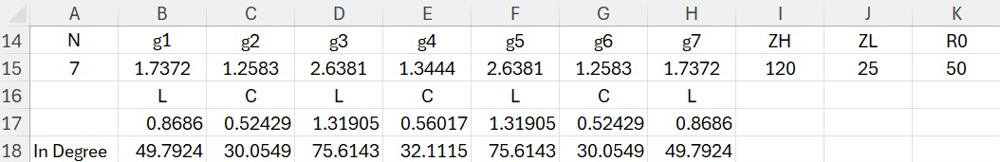

#### Put the value L, C, R0, Zh, and Zl in Sonet to see a graph that cutoff at 2 GHz or not.

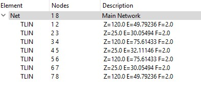

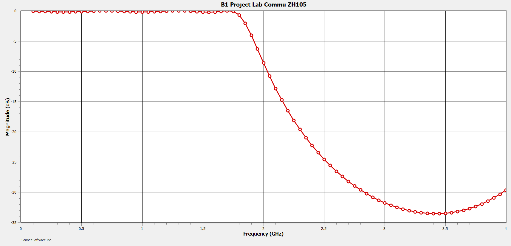

## Using Txline to find width and length of C, L, and R

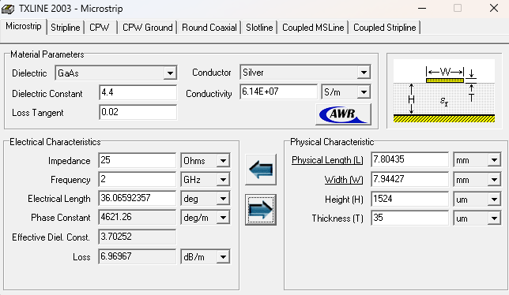

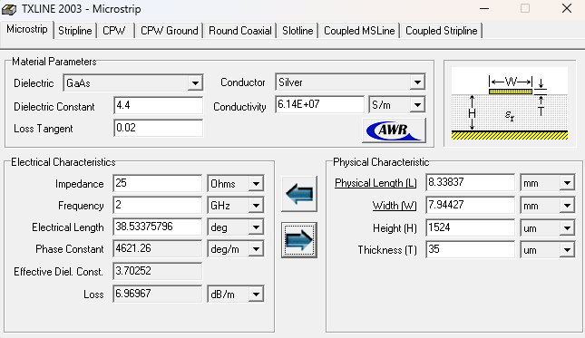

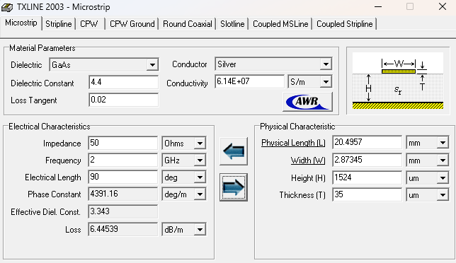

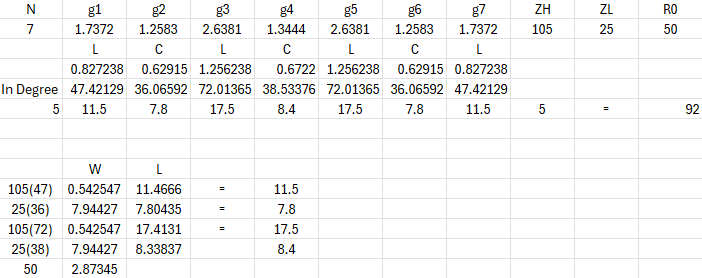

## Design PCB by using sonet.

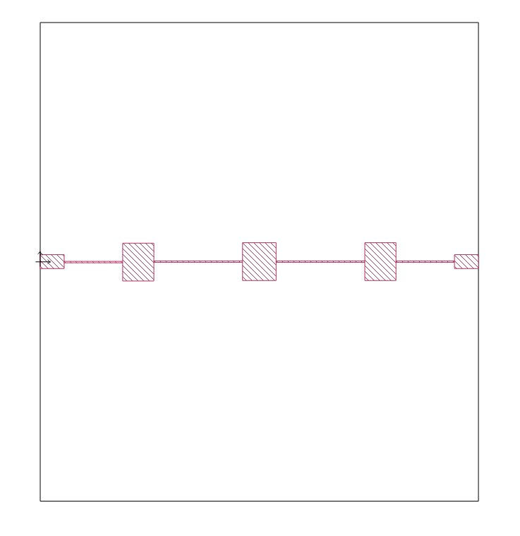
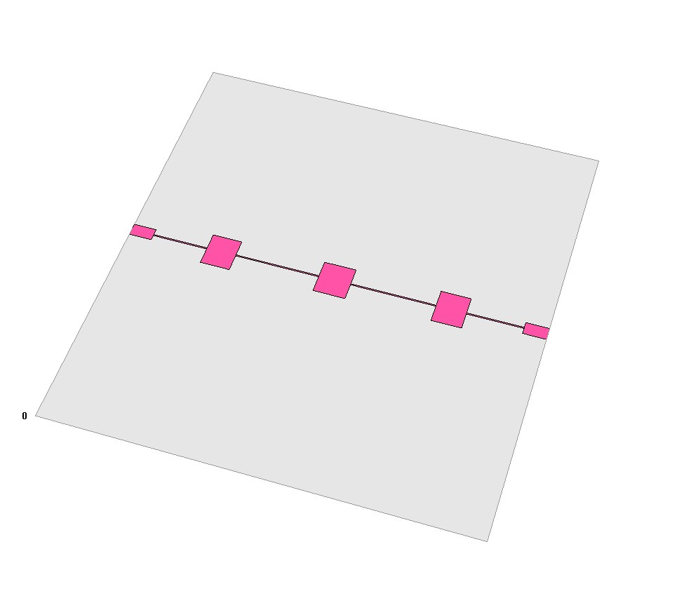

## Export file from sonet to build PCB in EasyEDA.

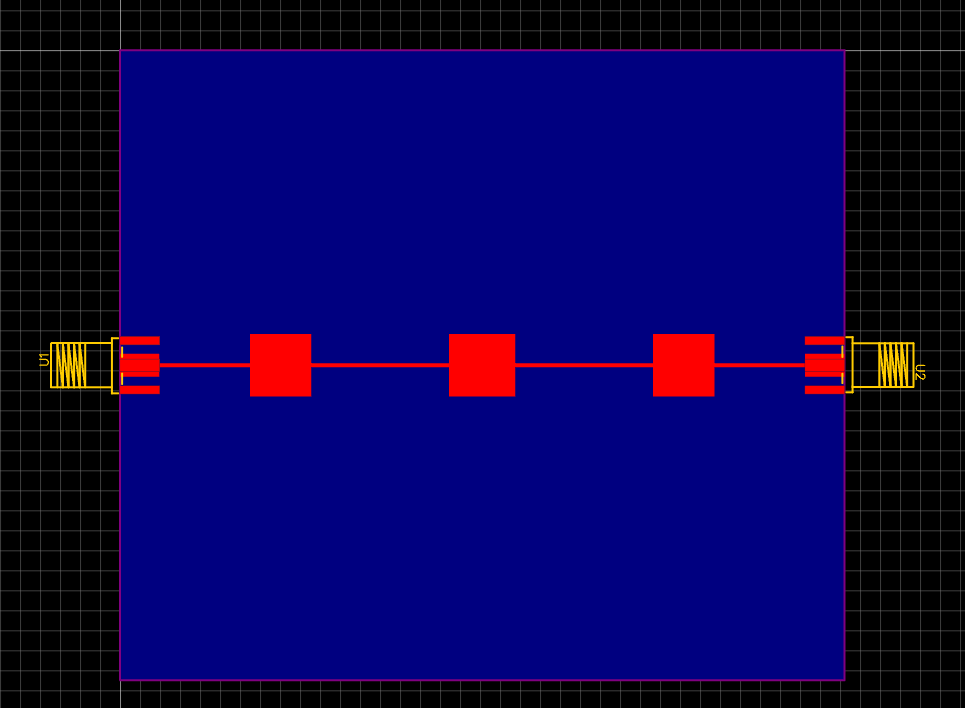
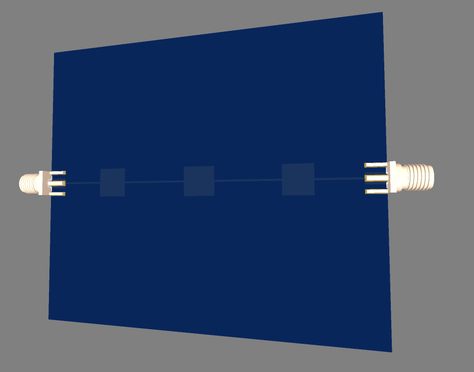

#### EasyEDA link: https://oshwlab.com/athit.sm/pcb1
## Export file from EasyEDA to order PCB in JLCPCB.
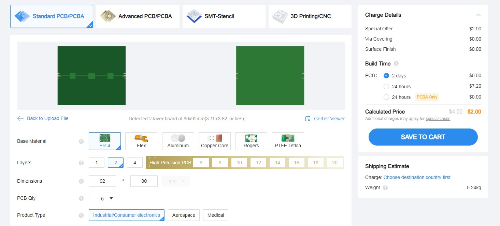
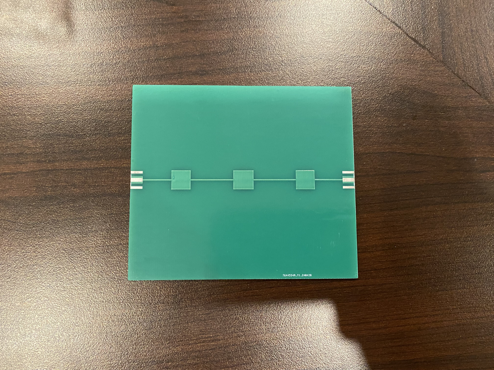

## Measure the real PCB board by reading the values ​​through the Putty program and then plotting the graph.
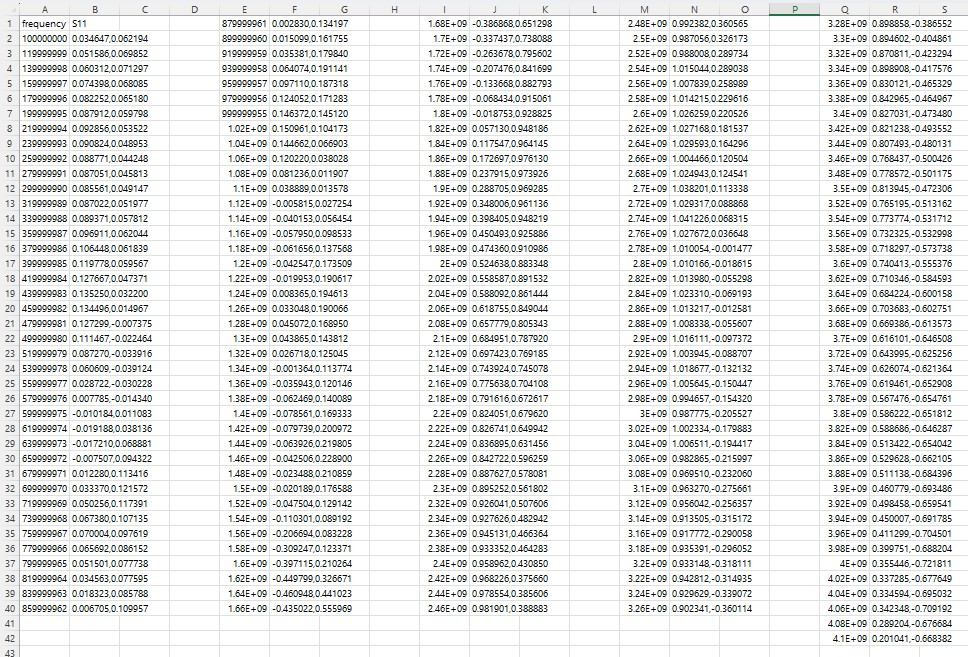

## Compare graph between sonnet and the real PCB board.
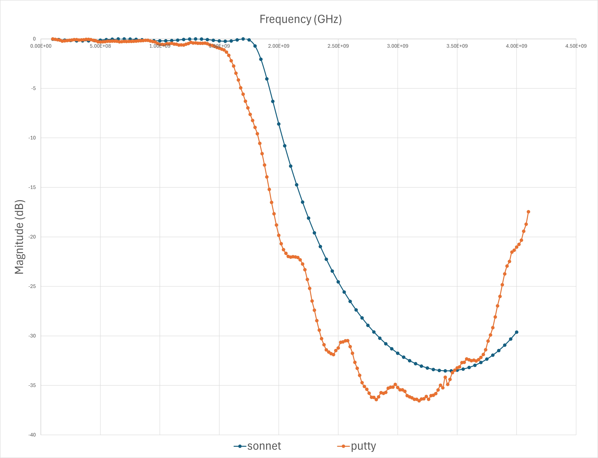

## Conclusion.
#### 

