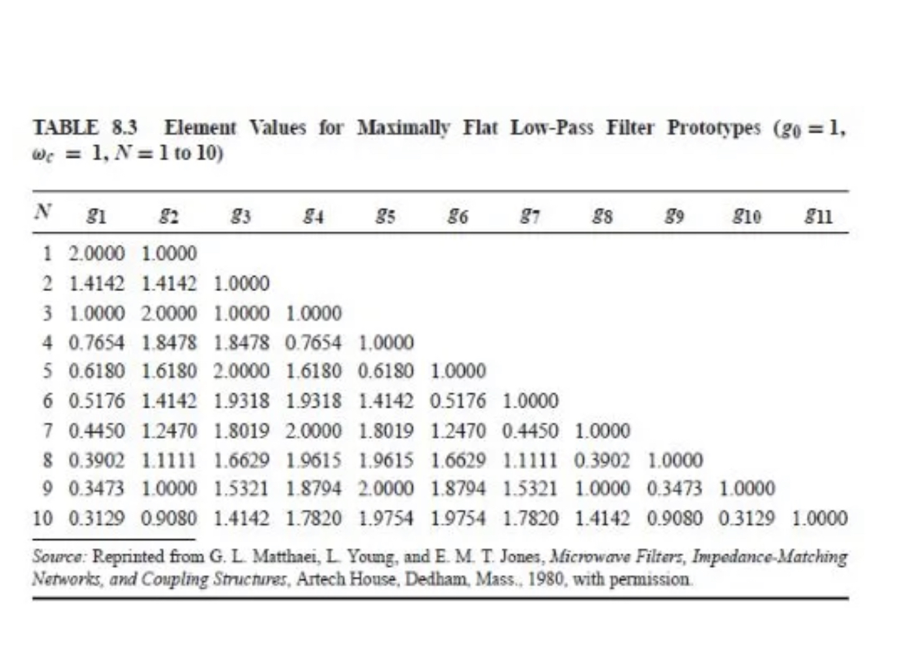
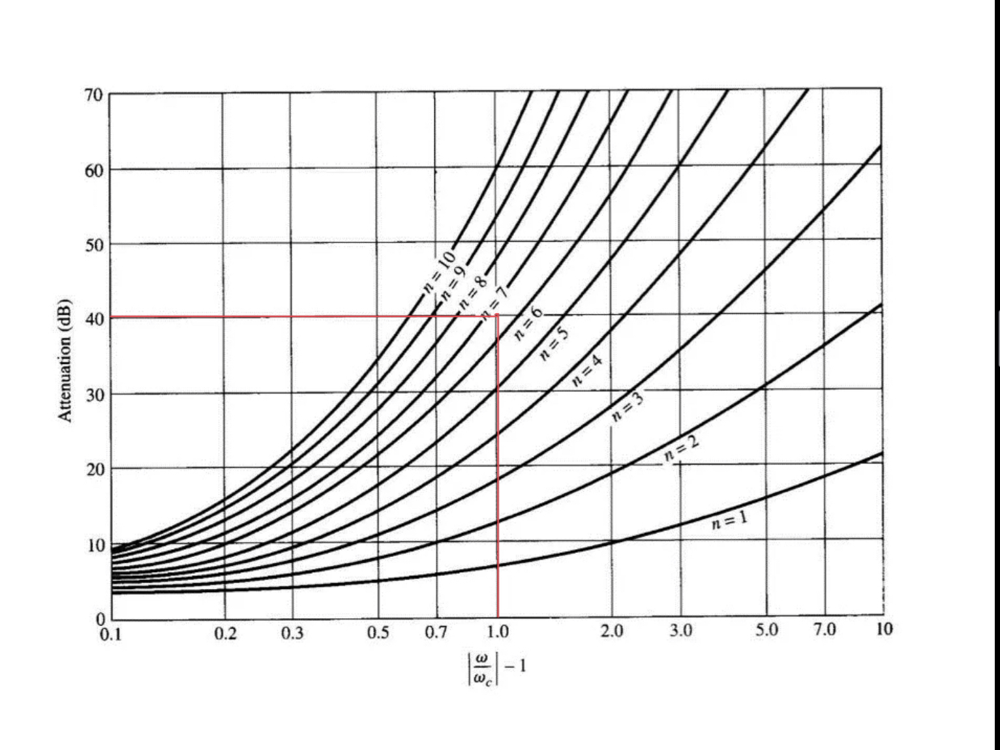
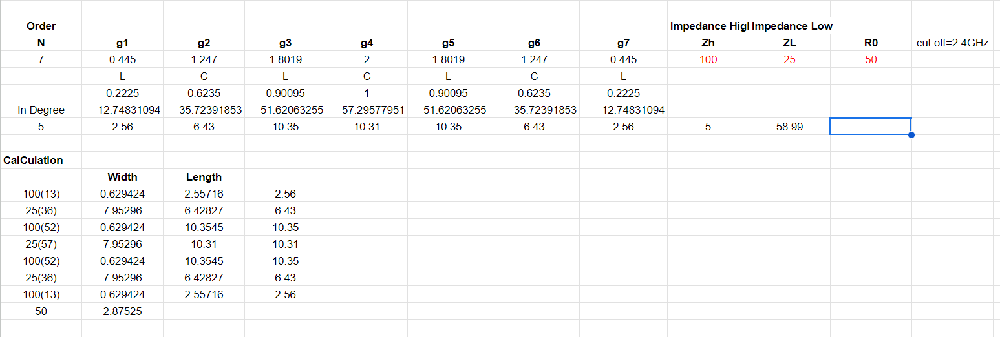
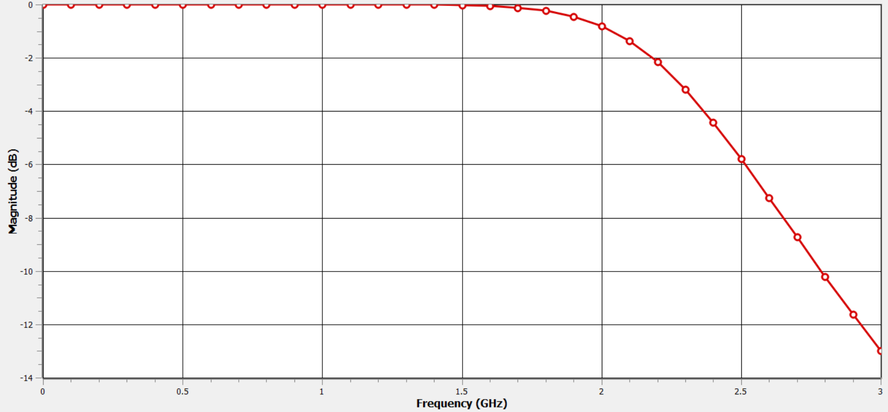
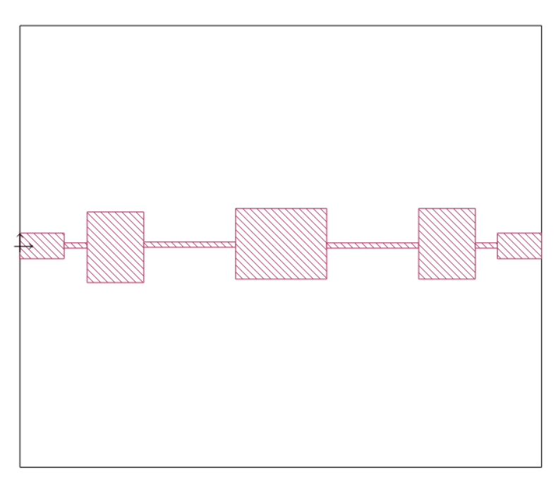
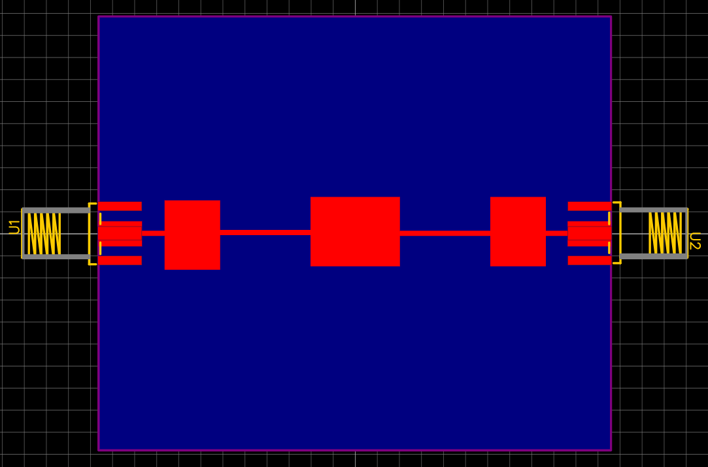
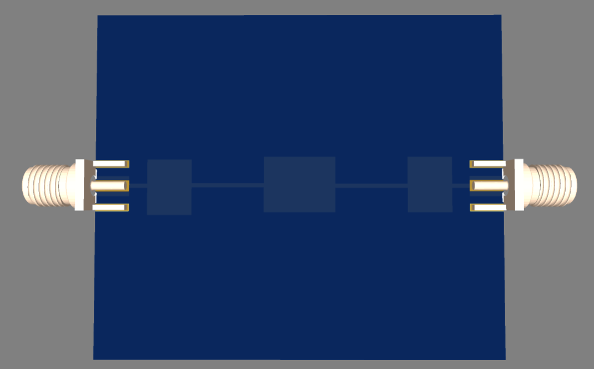

  

# Lab Report On 
# Transmission Line Filter Design
# Group Capybara group

### Submitted by

Krittapas 6410551037 
Natthapon 6410551053 
Thunwarach 6410554206 
Machaphat 6410554231 
Wiyadarat 6410551100 
### Present to

Asst.Prof. Denchai Worasawate

Communication Architecture and Devices Laboratory 01205381  
section 450 Semester 2/2023 

## Design a PCB LC Filter
##

## Step 1: How we Design our Low Pass Filter

Our specification of LPF ;  	1. Cut off 2.4GHz
2. ATTN 3GHz > 30dB
#### 1.We are choosing n = 7 from this graph

 

#### 2. From criteria given ATTN 3GHz > 30dB so from the graph above we are choosing n = 7 we will get (w/wc)-1 = 1 Calculation :
f = 4.8 GHz, fc = 2.4 GHz, (w/wc) - 1 = 1	

#### 3. From 1) and 2) we calculate the value as shown below.

 

## Step 2: Graph
We decide to use Zh = 100 ZL = 25 and R0 = 50 and we can calculate the length and width of the LPF 

## Step 3: designed LPF

## Step 4: design PCB by using EasyEDA
 
## Experiment
Take the Electrical Length, Impedance and Frequency values obtained from calculations on Excel using a butterworth filter 7 order to create a workpiece in the Sonnet program by finding the size from TXLine.

EasyEda Link : https://oshwlab.com/natthapon.r/TheFinalProject

## Conclusion

